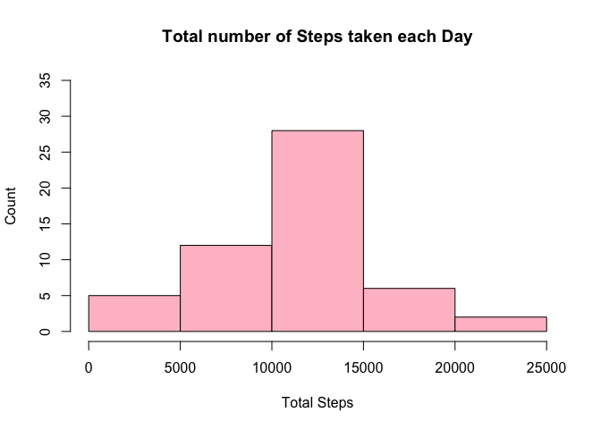
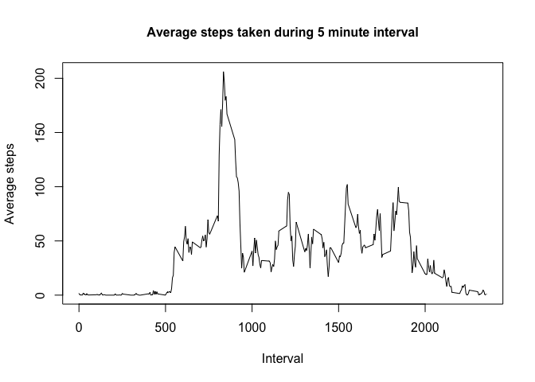
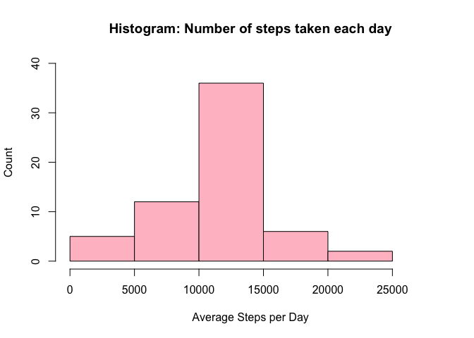
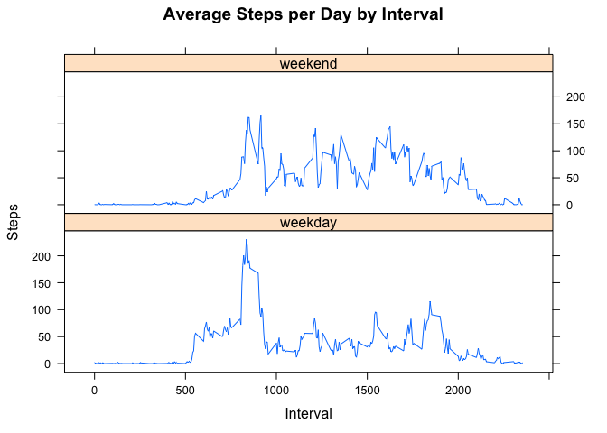

# Reproducible Research: Programming Assignment'
* Author: Line Ettrich
* Date: "3/22/2020"

## Pre- Preperations 

* Setting preferences for knitr

```r
knitr::opts_chunk$set(echo = TRUE)
```

## Loading and Preprocessing the Data

Step 1: Downloading and Unzipping the Data 

```r
if(!file.exists("./Data5")){dir.create("./Data5")}
fileUrl <- "https://d396qusza40orc.cloudfront.net/repdata%2Fdata%2Factivity.zip"
download.file(fileUrl,destfile="./Data5/ActivityMonitoring.zip")
unzip(zipfile="./Data5/ActivityMonitoring.zip",exdir="./Data5")
```

Step 2: Reading the File

```r
ActivityMonitoring <- read.csv("./Data5/activity.csv", header = TRUE)
```

Step 3: Reformatting the Date variable and Omitting NA's to transform the data into a format suitable for the analysis

* for the first few parts, the missing values will be omitted to do the analysis

```r
ActivityMonitoring$date <- format(as.Date(ActivityMonitoring$date), "%d/%m/%y")
ActivityMonitoring2 <- na.omit(ActivityMonitoring)
```

## What is mean total number of steps taken per day?

Loading the neccessary Packages (dplyr)

```r
library(dplyr)
```

```
## 
## Attaching package: 'dplyr'
```

```
## The following objects are masked from 'package:stats':
## 
##     filter, lag
```

```
## The following objects are masked from 'package:base':
## 
##     intersect, setdiff, setequal, union
```


Step 1: Calculating the Total Number of Steps per Day 

```r
Stepsperday <- ActivityMonitoring2 %>% 
  group_by(date) %>% 
  summarize(TotalSteps=sum(steps))
```

Step 2: Constructing the Histogram for the Total Number of Steps taken each Day 

```r
hist(Stepsperday$TotalSteps, 
     main = "Total number of Steps taken each Day", 
     xlab = "Total Steps", 
     ylab = "Count", 
     col = "pink",
     ylim = c(0, 35))
```

<!-- -->

Step 3: Calculating the Mean and Median Number of Steps taken each Day

```r
MeanSteps <- mean(Stepsperday$TotalSteps)
MedianSteps<- median(Stepsperday$TotalSteps)
```

## What is the average daily activity pattern?


Step 1: Calculating the Average Steps per Day

```r
AverageSteps <- ActivityMonitoring2 %>%
  group_by(interval) %>%
  summarize(AveSteps=mean(steps))
```

Step 2: Constructing a Time Series Plot for the Average Steps

```r
plot(AverageSteps$interval, AverageSteps$AveSteps, 
     type="l",
     xlab="Interval",
     ylab="Average steps",
     main="Average steps taken during 5 minute interval",
     cex.main = 1)
```

<!-- -->

Step 3: Calculating the 5-minute Interval that, on average, contains the maximum Number of Steps

```r
max_interval <- AverageSteps[which.max(AverageSteps$AveSteps),1]
max_interval
```

```
## # A tibble: 1 x 1
##   interval
##      <int>
## 1      835
```

## Imputing missing values

Step 1: Calculating the Total Number of NA's in the Dataset

```r
MissingValuesActivity <- is.na(ActivityMonitoring$steps)
sum(MissingValuesActivity)
```

```
## [1] 2304
```

Step: 2 Creating New Dataset in which Missing Values are replaced with averages

* I chose to replace the missing values with the averages for the 5 min intervals
* Below you finde the code that describes and shows the strategy for imputing missing data 

```r
NewActivityMonitoring <- ActivityMonitoring

for (i in 1:nrow(NewActivityMonitoring)) {
  if (is.na(NewActivityMonitoring$steps[i])) {
    indexvalue <- which(NewActivityMonitoring$interval[i] == AverageSteps$interval)
    NewActivityMonitoring$steps[i] <- AverageSteps[indexvalue,]$AveSteps
  }
}
```

Step 3: Constructing the Histogram of the Total Number of Steps taken each Day after Missing Values are imputed

```r
AverageStepNew <- NewActivityMonitoring %>% group_by(date) %>% summarize(AveSteps2= sum(steps))

hist(AverageStepNew$AveSteps2,
     ylab = "Count",
     xlab = "Average Steps per Day",
     main = "Histogram: Number of steps taken each day",
     col = "pink",
     ylim = c(0,40),
     xlim = c(0,28000))
```

<!-- -->

## Are there differences in activity patterns between weekdays and weekends?

Step 1: Calculating the Mean and Median for imputed Data

```r
mean(AverageStepNew$AveSteps2)
```

```
## [1] 10766.19
```

```r
median(AverageStepNew$AveSteps2)
```

```
## [1] 10766.19
```

Step 2: Assigning Weekday and Weekend Labels 

```r
NewActivityMonitoring$date <- as.POSIXct(NewActivityMonitoring$date, format = "%d/%m/%y")
NewActivityMonitoring$Day <- weekdays(NewActivityMonitoring$date)
NewActivityMonitoring$DayType <- "weekday"
NewActivityMonitoring$DayType[NewActivityMonitoring$Day %in% c("Saturday", "Sunday")] <- "weekend"
```

Step 3: Loading Lattice Package

```r
library(lattice)
```

Step 4: Computing the Average Steps for Weekdays/Weekends

```r
StepsByInterval <- aggregate(steps ~ interval + DayType, NewActivityMonitoring, mean)
```

Step 5: Creating a Time Series Plot for the Average Steps per day by Interval

```r
xyplot(StepsByInterval$steps ~ StepsByInterval$interval|StepsByInterval$DayType, 
       main="Average Steps per Day by Interval",
       xlab="Interval", 
       ylab="Steps",
       layout=c(1,2), type="l")
```

<!-- -->
